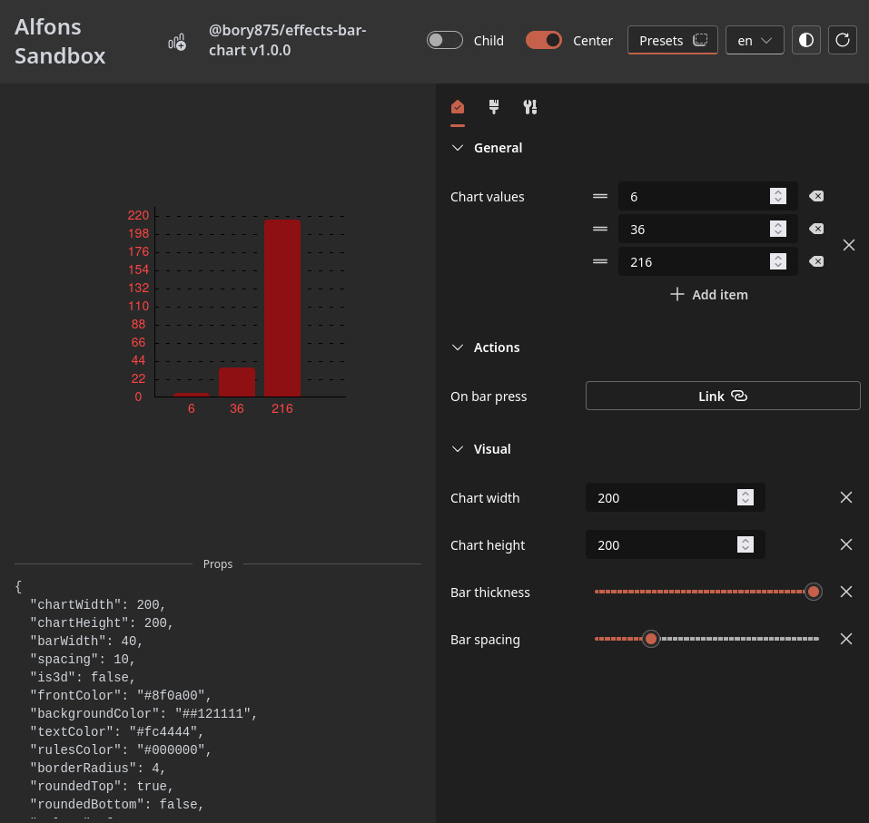

# Bar Chart Plugin

### Instalace

1. Nastavit .npmrc pro alfons balíčky
2. Nastavit si NPM_TOKEN proměnnou prostředí
3. pnpm i
4. Je možné, že v instalaci alfons z npm chybí uuid dependency, pokud ano, je nutné ji tam ručně dopsat a nainstalovat.
5. pnpm sandbox

### Features

- Plugin poskytuje funkcionalitu barchart knihovny.
- Vlastnosti nastavitelné v editoru:
  - Šířka grafu
  - Šířka grafu
  - Šířka grafu
  - Rozestup mezi sloupci
  - 3D zobrazení (efekt 3D sloupců)
  - Hodnoty grafu - pole čísel
  - Akce po stisku sloupce
  - Míra zaoblení hran sloupců
  - Zaoblení hran dole - switch
  - Zabolení hran nahoře - switch
  - Barva textu
  - Barva pozadí
  - Barva sloupců
  - Barva horizontálních čar

